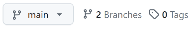

# Remote Tracking Branches {#remote-tracking-branch}

[i[Branch-->Remote tracking]<]

We've seen how to create local branches that you do work on, then merge
back into the `main` branch, then `git push` it up to a remote server.

This part of the guide is going to try to clarify what's actually going
on behind the scenes, as well as give us a way to push our local
branches to a remote for safe keeping.

## Branches on Remotes

[i[Branch-->On remote]<]

First, some refresher!

Recall that the remote repo you cloned yours from is a complete copy of
your repo. The remote repo has a `main` branch, and therefore your
clone also has a `main` branch.

That's right! When you make a GitHub repo and then clone it, there are
**two** `main` branches!

How do we differentiate them?

Well, on your local clone, we just refer to branches by their plain
name. When we say `main` or `topic2`, we mean the local branch by that
name on our repo.

If we want to talk about a branch on a remote, we have to give the
remote name along with the branch using that slash notation we've
already seen:

``` {.default}
main            # main branch on your local repo
origin/main     # main branch on the remote named origin
upstream/main   # main branch on the remote named upstream
zork/mailbox    # mailbox branch on the remote named zork
mailbox         # mailbox branch on your local repo
```

Importantly, not only do the words `origin/main` refer to the `main`
branch on `origin` in casual conversation, but _you actually have a
branch on your local repo called `origin/main`_.

This is called a _remote-tracking branch_. It's your local copy of the
`main` branch on the remote. You can't move your local `origin/main`
branch directly; Git does it for you as a matter of course when you
interact with the remote (e.g. when you push or pull).

We're going to call the `main` branch on our local machines the _local
branch_, and we'll call the one on `origin` the _upstream branch_.

> **And this is going to get confusing later** when we name a remote
> `upstream` in a way that has nothing to do with the _upstream branch_
> terminology we're using here.

I want to go over that one more time to drive it home.

Let's say you have these two branches on your computer because you've
just cloned the remote repo at the `origin`:

``` {.default}
main            # main branch on your local repo
origin/main     # main branch on the remote named origin
```

When you have those two branches on your computer, *there are actually
three branches in the world*. 

1. `main` on your computer.
2. `origin/main` on your computer.
3. `main` on the `origin` computer, usually a different computer than
   yours, e.g. one at GitHub or something.

Notice that the first two of these are on the repo on your computer!

The branch `origin/main` is just where your computer *thinks* that
`main` on the `origin` is. Your computer got this information the last
time you pulled or fetched from `origin`.

If other people have pushed to `main` on `origin` since your last pull,
your `origin/main` on your local computer won't be up to date.

And normally you don't have to worry about this much; when you try to
push, Git will tell you if someone else has pushed changes in the
meantime and you have to pull first to update your `origin/main` branch.
No biggie.

But I wanted to spell that out so you had a more complete mental model
of what's happening behind the curtain, here.

[i[Branch-->On remote]>]

## Listing Remote Tracking Branches

[i[Branch-->Listing remote tracking]<]

Remember how `git branch` listed the branches you had? Let's power it
up so you can see all the remote tracking branches, as well. This will
help in the following sections.

Basically, we just give it the `-avv` switch for "all" (to list the
remote tracking branches) and "verbose" (to give info about which
commits they're pointing to) and "verbose" again (to give info about
which remote branches map to which remote branches.

Here's the result for the repo that holds the source for this book:

``` {.default}
% git branch -avv
  * main                  2d63af5 [origin/main] indexing
    sphinx                cdac325 [origin/sphinx] partial port
    remotes/origin/HEAD   -> origin/main
    remotes/origin/main   2d63af5 indexing
    remotes/origin/sphinx cdac325 partial port
```

We see my two local branches (`main` and `sphinx`). Looking on those two
top lines, you see remote tracking branches in brackets (`origin/main`
and `origin/sphinx`). When I push or pull from `main` or `sphinx`, those
are the remote tracking branches that are merged to.

Additionally, we see information about the remote below that.

The first line about `remotes/origin/HEAD` is a little strange. It just
points to `origin/main` which simply lets us know that `main` is the
initial branch for the repo that Git will use when you clone it. You
typically don't need to think about this line.

The remaining two lines tell us what commits the remote tracking
branches `origin/main` and `origin/sphinx` are pointing at. Looking
closely, we see they're pointing to the same commits as our local `main`
and `sphinx` indicating that everything is in sync. (As far as we
know—someone else might have pushed something to the repo since our last
pull and we don't know about that yet.)

[i[Branch-->Listing remote tracking]>]

## Pushing to a Remote

[i[Branch-->Set upstream]<]

Fun Fact: when you push or pull, you technically specify the remote and
the branch you want to use. This is me saying, "Push the branch I'm on
right now (presumably `main`) and merge it into `main` on `origin`.

[i[Push-->Branch to remote]]
[i[Branch-->Pushing to remote]]
``` {.default}
$ git push origin main
```

"But wait! I haven't been doing that!"

It turns out there's an option you can set to make it happen
automatically. Let's say you're on the `main` branch and then run this:

``` {.default}
$ git push --set-upstream origin main
$ git push -u origin main              # same thing, shorthand
```

This will do a couple things:

1. It'll push changes on your local `main` to the remote server (that's
   the `push origin main` part).
2. It'll remember that the remote branch `origin/main` is tracking your
   local `main` branch (that's the `-u` part).

And then, from then on, from the `main` branch, you can just:

``` {.default}
$ git push
```

and it'll automatically push to `origin/main` thanks to your earlier
usage of `--set-upstream`.

And `git pull` has the same option, as well, though you only need to do
it once with either push or pull.

"But wait! I've never used `--set-upstream`, either!"

That's because by default when you clone a repo, Git automagically sets
up a local branch to track the `main` branch on the remote.

> **Depending on how you made your repo, you might also have a reference
> to `origin/HEAD`.** It might be weird to think that there's a `HEAD`
> ref on a remote server that you can see, but in this case it's just
> referring to the branch that you'll be checking out by default when
> you clone the repo.

"OK, so what you're telling me is that I can just `git push` and `git
pull` like always and just ignore everything you wrote in this section?"

Well... yes. Ish. No. We're going to make use of this to push other
branches to the remote!

[i[Branch-->Set upstream]>]

## Making a Branch and Pushing to Remote

[i[Push-->Branch to remote]<]

I'm going to make a new local branch `topic99`:

``` {.default}
$ git switch -c topic99
  Switched to a new branch 'topic99'
```

And make some changes:

``` {.default}
$ vim README.md        # Create and edit a README
$ git add README.md
$ git commit -m "Some important additions"
```

In our log, we can see where all the branches are:

``` {.default}
commit 79ddba75b144bad89e1cbd862e5f3b3409f6c498 (HEAD -> topic99)
Author: User Name <user@example.com>
Date:   Fri Feb 16 16:44:50 2024 -0800

    Some important additions

commit 3be2ad2c31b627b431af8c8e592c01f4b989d621 (origin/main, main)
Author: User Name <user@example.com>
Date:   Fri Feb 16 16:14:13 2024 -0800

    Initial checkin
```

`HEAD` refers to `topic99`, and that's one commit ahead of `main`
(local) and `main` (upstream on the `origin` remote), as far as we know.
And we know this because it's one commit ahead of our remote-tracking
branch `origin/main`.

Now let's push!

``` {.default}
$ git push
  fatal: The current branch topic99 has no upstream branch.
  To push the current branch and set the remote as upstream, use

      git push --set-upstream origin topic99

  To have this happen automatically for branches without a tracking
  upstream, see 'push.autoSetupRemote' in 'git help config'.
```

Ouch. The short of all this is that we said "push", and Git said, "To
what? You haven't associated this branch with anything on the remote!"

And we haven't. There's no `origin/topic99` remote-tracking branch, and
certainly no `topic99` branch on that remote. Yet.

The fix is easy enough—Git already told us what to do.

[i[Branch-->Set upstream]]

```{.default}
$ git push --set-upstream origin topic99
```

And that will do it.

[i[GitHub-->Branches]]

At this point, assuming you've pushed to GitHub, you could go to your
GitHub page for the project, and near the top left you should see
something that looks like Figure_#.1.



If you pull down that `main` button, you'll see `topic99` there as well.
You can select either branch and view it in the GitHub interface.

[i[Push-->Branch to remote]>]

## Deleting Remote Tracking Branches

[i[Branch-->Deleting remote]<]
[i[Branch-->Deleting remote tracking]<]

There are few things that can happen here.

1. Someone deletes the branch on the remote, but your corresponding
   remote tracking branch (the one on your clone) still exists and you
   want to delete it.

2. You want to delete your remote tracking branch, and you want to leave
   the corresponding branch untouched on the remote.

3. You delete your remote tracking branch and you want to delete the
   corresponding branch on the remote, too.

For all of these, it's good to have your working tree clean, of course.

### Fetching Deleted Remote Branches

The first one is pretty easy. Let's tell Git to delete all our remote
tracking branches that no longer exist on the `origin` remote:

[i[Fetch-->Pruning remote tracking branches]]
``` {.default}
$ git fetch --prune
```

or if you want to specify a remote:

``` {.default}
$ git fetch --prune someremote
```

or if you want to prune all remotes:

``` {.default}
$ git fetch --prune --all
```

### Deleting Your Remote Tracking Branch

In this case, you have a remote tracking branch on your clone that you
want to delete. But you don't want to delete that branch from the
server.

Use `-d` for delete and `-r` for remote:

``` {.default}
$ git branch -dr remote/branch
``` 

For example:

``` {.default}
$ git branch -dr origin/topic99
``` 

### Deleting a Branch on a Remote

Finally, let's say you've deleted your remote tracking branch on your
clone, as per above, and you also want to delete it on the remote.

We're going to (perhaps surprisingly) use `git push` for this.

To delete a branch on the remote, you:

``` {.default}
$ git push someremote --delete branchname
``` 

For example:

``` {.default}
$ git push origin --delete topic99
``` 

And that's it! Make sure you delete your remote tracking branch if you
haven't done so already.

[i[Branch-->Deleting remote]>]
[i[Branch-->Deleting remote tracking]>]

## Multiple Remotes

[i[Remote-->Multiple]<]

It's possible that you might have multiple remotes. (This is commonly
put in place when you've forked someone's repo on GitHub.)

How do remote tracking branches work in that case?

Let's say your main remote is called `origin` as usual. But you've also
set another remote called `remote2`, unoriginally.

Someone else pushes a new branch called `foobranch` (slightly more
originally) up to `remote2` and you'd like to get it.

So you do this:

[i[Fetch]]

``` {.default}
$ git fetch remote2
  remote: Enumerating objects: 15, done.
  remote: Counting objects: 100% (15/15), done.
  remote: Compressing objects: 100% (4/4), done.
  remote: Total 12 (delta 6), reused 11 (delta 5), pack-reused 0
  Unpacking objects: 100% (12/12), 1.61 KiB | 34.00 KiB/s, done.
  From github.com:user/somerepo
   * [new branch]      foobranch -> remote2/foobranch
```

So far so good. Let's switch to it:

``` {.default}
$ git switch foobranch
  branch 'foobranch' set up to track 'remote2/foobranch'.
  Switched to a new branch 'foobranch'
```

Wait! We're tracking at `remote2`? That's a little weird because it's
the other person's repo. Maybe you have permission to write to it, and
that's what you want to do. But it's more probably you'd like your own
version of this branch on your repo as well.

You can do that by pushing it to your remote with `-u` again.

``` {.default}
$ git push -u origin foobranch
```

And that'll do it.

If you look at your branches with `git branch -avv` you'll see now
several `foobranch` variants for different clones.

``` {.default}
foobranch
remotes/origin/foobranch
remotes/remote2/foobranch
```

If you want to keep your `origin/foobranch` in sync with that on
`remote2`, you'll have to do a bunch of merging.

[i[Fetch]]

``` {.default}
$ git fetch remote2            # Get remote2 changes
$ git switch foobranch         # Get onto the merge-into branch
$ git merge remote2/foobranch  # Merge changes from remote2
$ git push origin foobranch    # Push changes back to origin
```

(You can leave the `origin foobranch` off the `push` if you've already
pushed it with `-u` earlier, of course.)

At that point, every `foobranch` should be on the same commit.

[i[Remote-->Multiple]>]
[i[Branch-->Remote tracking]>]
