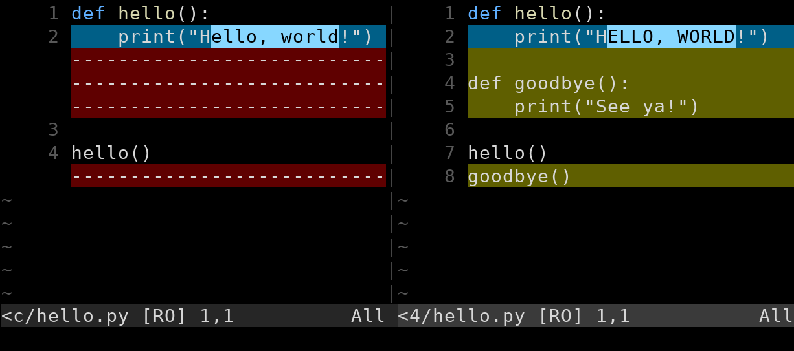

# Comparing Files with Diff

The powerful `git diff` command can give you differences between two
files or commits. We mentioned it briefly at the beginning, but here
we're going to delve more deeply into all the things you can do with it.

It's not the easiest thing to read at first, but you do get used to it
after a while. My most common use case is to quickly scan to remember
what I've changed in the working tree so I know what to add to the stage
and what commit message to use.

## Basic Usage

The most basic use case is that you've modified some files in your
working tree and you want to see what the differences are between what
was there and what you added.

For example, let's say I've modified my `hello.py` file (but haven't
staged it yet). I can check out what I've changed like so:

``` {.default}
$ git diff
  diff --git a/hello.py b/hello.py
  index 4a8f53f..8ee1fe4 100644
  --- a/hello.py
  +++ b/hello.py
  @@ -1,4 +1,8 @@
   def hello():
  -    print("Hello, world!")
  +    print("HELLO, WORLD!")
  +
  +def goodbye():
  +    print("See ya!")

   hello()
  +goodbye()
```

What do we have there? Why, it's an impenetrable mess, of course!

_The End_

All right, take a deep breath and let's figure it out.

Since the output is plastered over with `hello.py`, we can safely
assume this is the file we're talking about. If the diff is reporting on
multiple files (e.g. you're comparing two commits), each file will have
its own section in the output.

> **The `index` line has the blob hashes and file permissions.** A blob
> hash is the hash of the specific file in the states being compared.
> This isn't something you need to worry about, typically. Or maybe not
> even ever.

After that we have a couple lines indicating the that old version of the
file `a/hello.py` is the one marked with minus signs, and the new
version (that you haven't staged yet) is `b/hello.py` and is marked with
plus signs.

Then we have `@@ -1,4 +1,8 @@`. This means that lines 1-4 in the old
version are shown, and lines 1-8 in the new version are shown. (So
clearly we've at least added some lines here.)

Finally, we get to the steak and potatoes of the whole thing—what has
actually changed? Remembering that the old version is minus and the new
version is plus, let's look at just that part of the diff again:

``` {.default}
   def hello():
  -    print("Hello, world!")
  +    print("HELLO, WORLD!")
  +
  +def goodbye():
  +    print("See ya!")

   hello()
  +goodbye()
```

Rules:

* If a line is prefixed with `-`, it means this is how the line was in
  the old version.

* If a line is prefixed with `+`, it means this is how the line is in
  the new, modified version.

* If a line is not prefixed with anything, it means it is unchanged
  between the versions.

> **The diff won't show you all the lines of the file!** It only shows
> you what's changed and some of the surrounding lines. If there are
> changes in different parts of the file, the unchanged parts of the
> file will be skipped over in the diff.

Another way to read the diff is that lines with a `-` have been removed
and lines with a `+` have been added.

## Diffing the Stage

What if you've added some stuff to the stage and you want to diff it
against the previous commit?

Just typing `git diff` shows nothing!

Why?

The answer is really easy: `git diff --staged`[^91c6]. Done.

[^91c6]: The `--staged` flag is more modern. Older versions of Git used
    `git diff --cached`.

But I want to use this subsection to dig a little deeper into what's
happening so you can improve your understanding of how this works.

A good mental model here is to imagine that the stage **must** have one
of two things on it at all time, either of these:

1. A copy of a file from the last commit. If this is the case, `git
   status` will not show the file on the stage.
2. A copy of a file from the working tree, something modified from the
   last commit. In this case `git status` **will** show something on the
   stage.

So in this mental model, *something* is always on the stage. It's just
that you don't see it unless it's something different than the last
commit that you put there with `git add`.

OK? I know I'm asking you to just bear with me on faith, so thank you
for that.

Back to the question: if you have added some modified files to the
stage, why does `git diff` show nothing is changed?

*It's because `git diff` **always** compares the working tree to the
stage.* (Unless you're diffing specific commits—see below.) And in this
case, after you've added your modified file to the stage, it's the same
as the working tree. So no diffs.

Contrast this to where you've modified the working tree but *haven't*
added the file to the stage. In this case, the file on the stage is just
like the last commit, which is different than your working tree. So `git
diff` shows the differences.

Got it?

Well, okay, then... what if you *want* to diff what's on the stage with
the last commit?  That is, instead of diffing the working tree with the
stage, you want to diff the stage with the `HEAD`?

Back to the punchline:

``` {.default}
$ git diff --staged
```

And that'll do it.

## More Diff Fun

Let's speed through some examples of things you can do with diff.

### Diff Any Commits or Branches

You have more at your disposal than just diffing the working tree or
stage. You can actually diff any two commits. This will show you all the
differences between them.

For example, if you know the commit hashes, you can diff them directly:

``` {.default}
$ git diff d977 27a3
```

Or if you have two branch names:

``` {.default}
$ git diff main topic
```

Or mix and match:

``` {.default}
$ git diff main 27a3
```

Or use `HEAD`:

``` {.default}
$ git diff HEAD 27a3
```

Or relative `HEAD`:

``` {.default}
$ git diff HEAD~3 HEAD~4
```

That last one diffs three commits before `HEAD` with four commits before
`HEAD`.

### Diffing with Parent Commit

We just showed this example:

``` {.default}
$ git diff HEAD~3 HEAD~4
```

But since `HEAD~4` is the parent of `HEAD~3`, is there some shorthand we
can use here? Yes!

``` {.default}
$ git diff HEAD~3 HEAD~4
$ git diff HEAD~3^!          # Same thing!
```

You can use it anywhere you want to compare a commit with its parent,
which is really showing just what changes were in that one particular
commit.

``` {.default}
$ git diff HEAD^!
$ git diff HEAD~3^!
$ git diff main^!
$ git diff 27a3^!
```

### More Context

By default, `git diff` shows 3 lines on context around the changes. If
you want to see more, like 5 lines, use the `-U` switch.

``` {.default}
$ git diff -U5
```

### Just the File Names

If you just want a list of files that have changed, you can use the
`--name-only` option.

``` {.default}
$ git diff --name-only
```

### Ignoring Whitespace

There might be a time when you get some tabs/spaces confusion in your
source code, which is always painful. Protip: stick to one and force
everyone else on the team to do the same under penalty of paying for
lunch.

But you can commit `git diff` to ignore whitespace in the comparison:

``` {.default}
$ git diff -w
$ git diff --ignore-all-space    # Same thing
```
### Just Certain Files

You can just diff certain files.

One way is to just put the file names after a `--`:

``` {.default}
$ git diff -- hello.py
$ git diff -- hello.py another_file.py
```

You can also specify commits or branches before the `--`:

``` {.default}
$ git diff somebranch -- hello.py
```

That'll compare `hello.py` at `HEAD` with the version on `somebranch`.

Or you could give two commits or branches to compare the file there:

``` {.default}
$ git diff main somebranch -- hello.py
```

Finally, you can restrict to a file extension using a glob and single
quotes:

``` {.default}
$ git diff '*.py'
```

That will just diff the Python files.

### Inter-branch Diffs

This is an interesting version of comparing two branches.

We already showed the following example for comparing the commits at two
branches:

``` {.default}
$ git diff branch1 branch2
```

But sometimes you want to know what changed in a branch *since the
branches diverged*.

That is, you don't want to know what's different *now* between `branch1`
and `branch2`, which is what the above would give you.

You want to know what `branch2` added or deleted that `branch1` did not.

In order to see this, you can use this notation:

``` {.default}
$ git diff branch1...branch2
```

This means "diff the common ancestor of `branch1` and `branch2` with
`branch2`."

In other words, tell me all the changes that were made in `branch2` that
`branch1` is unaware of. Don't show me anything that `branch1` has
changed since they diverged.

## Difftool

Admittedly, that diff output is hard to read. I swear, though, you do
get used to it. I use it all the time.

That said, it can be nicer to see something more *visual*, you know,
like the old version on the left and the new version on the right in a
way that's visually easier to comprehend.

> **If you're using VS Code, you get some nice diffing for free and
> don't necessarily need to pay attention to this section.** See more in
> the VS Code chapter.

First, the bad news is that Git doesn't support this out of the box.

The good news is that there are a lot of third-party tools that do, and
you can easily hook them up so that they work with Git super easily.

How easy?

Once you set it up, you'll be able to just write `difftool` instead of
`diff` on the command line. For example:

``` {.default}
$ git difftool HEAD~3^!
```

And what does that get you? For me, where I use Vim and have Vimdiff set
up as my difftool, it gives me a screen like in Figure_#.1.



This might be a little tough to see in black and white, but what we have
is the old version on the left and the new version on the right. The
lines of minus signs on the left indicate lines that don't exist in the
old version, and we can see highlighted lines on the right that exist in
the new version.

But if you try that, it won't work. You have to configure it first.

### Configuring

Firstly, git normally prompts you before launching a third-party
difftool. This is annoying, so let's turn it off globally:

``` {.default}
$ git config --global difftool.prompt false
```

Secondly, we need to tell it which tool to use.

``` {.default}
$ git config --global diff.tool vimdiff
```

And that might be enough. If `vimdiff` (or whichever diff tool you're
using) is in your `PATH`[^43a2], you should be in business and you're
good to go.

[^43a2]: Setting the `PATH` is outside the scope of this tutorial, but
    the short of it is if you can run the diff tool command on the
    command line (e.g. by running `vimdiff`), then it is in the `PATH`.
    If it says `command not found` or some such, then it is **not** in
    the `PATH`. Search the Intertubes for how to add something to the
    `PATH` in Bash. Or set the Git path config explicitly, as shown in
    the following paragraph.

If it's not in your `PATH`, maybe because you installed it locally in
your home directory tree somewhere, you can either add it to your `PATH`
(search the Net for how to do this), *or* you can specify the full path
to your particular difftool. Here's an example with `vimdiff`, which is
redundant for me because `/usr/bin` is already in my `PATH`.

``` {.default}
$ git config --global difftool.vimdiff.path /usr/bin/vimdiff
```

If you're using a different difftool other than `vimdiff`, replace that
part of the config line with the name of the command.

Again, you only have to set the path if the tool isn't installed in a
standard place.

### Available Difftools

There are a number of diff tools out there you can choose from. Here's a
partial list, with the caveat that I've only ever used
Vimdiff.

* Vimdiff (comes with [fl[Vim|https://www.vim.org/]])
* [fl[Kompare|https://apps.kde.org/kompare/]]
* [fl[WinMerge|https://winmerge.org/?lang=en]]
* [fl[Meld|https://meldmerge.org/]]
* [fl[Kdiff3|https://kdiff3.sourceforge.net/]]
* [fl[Beyond Compare|https://www.scootersoftware.com/]]
* [fl[DiffMerge|https://sourcegear.com/diffmerge/]]
* [fl[P4Merge|https://www.perforce.com/products/helix-core-apps/merge-diff-tool-p4merge]]
* [fl[Araxis Merge|https://www.araxis.com/merge/index.en]]

Some of these are free, some are paid, and some are free trial.

And remember, VS Code has this functionality without using difftool.

